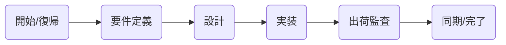

# Antigravity 運用マニュアル

このリポジトリには、開発を「最高速度」かつ「最高品質」で進めるための自律型エージェント設定 (Antigravity) が組み込まれています。
本マニュアルでは、その使いこなし方と、AIへの指示テンプレートをまとめます。

---

## 🚀 基本サイクル (The Golden Cycle)

開発は以下のサイクルで回してください。**全てのフェーズに専用コマンドがあります。**



| フェーズ | コマンド | やること |
| :--- | :--- | :--- |
| **1. 開始** | `@[/onboard]` | 現状把握。「前回何したっけ？次は？」を教えてくれる。 |
| **2. 要件** | `@[/spec-phase]` | 何を作るか決める。「これ提案して」と言えば全部書いてくれる。 |
| **3. 設計** | `@[/design]` | **最重要**。DB/API/構成図を作る。「全部提案して」でOK。 |
| **4. 実装** | `@[/impl]` | 設計書通りにコーディング。タスク分解して一気に作る。 |
| **5. 出荷** | `@[/ship]` | **最終関門**。テスト・レビュー・セキュリティ・性能・品質を全チェック。 |
| **6. 掃除** | `@[/sync]` | ドキュメントとコードのズレを直し、次へ備える。 |

---

## 🛠️ 便利コマンド (Utility)

困ったときや、既存コードを直したいときはこれを使います。

- **`@[/consult]` (コンサル)**: 「もっと良くするには？」を能動的に提案してもらう。既存PJの診断に最適。
- **`@[/refactor]` (安全な掃除)**: 「壊さずに綺麗にする」。テスト→修正→テストを自動で行う。動作が変わったらロールバックされる。
- **`@[/sec]` (セキュリティ)**: 脆弱性やインフラ設定の監査だけを単独で行う。
- **`@[/test]` (高速テスト)**: テストがないなら勝手に作り、エラーなら勝手に直す。

---

## 💬 コピペで使えるチャットテンプレート

AIへの指示に迷ったら、以下をコピーして使ってください。

### ケース1: 新機能を作りたいとき
```markdown
@[/spec-phase]
# 新機能の要望
現在作成中のアプリに「タスク管理機能」を追加したいです。
ユーザーがタスクを追加・編集・削除できるようにしたい。
詳細な要件や非機能要件は、一般的なWebアプリの構成で**全て提案してください**。
```

### ケース2: バグを直したいとき
```markdown
@[/impl]
# バグ修正依頼
以下の事象が発生しているので、原因を調査して修正してください。
- 事象: ログイン画面で「送信」を押しても反応がない。
- 期待値: ダッシュボードに遷移すること。
※ 修正前に必ず原因の仮説を立てて説明してください。
```

### ケース3: 既存コードを綺麗にしたいとき
```markdown
@[/refactor]
対象: src/features/auth/AuthService.ts

上記のファイルが300行を超えて読みづらいです。
機能は一切変えずに、可読性を上げるためにリファクタリングしてください。
ロジックの分離や関数の抽出を行ってください。
```

### ケース4: 途中から参画したプロジェクトで現状を知りたいとき
```markdown
@[/consult]
このプロジェクトに初めて参画しました。
コードの品質、ディレクトリ構成の問題点、セキュリティリスクなど、
改善すべき点を**辛口で**リストアップしてください。
```

### ケース5: とにかくリリースしていいか不安なとき
```markdown
@[/ship]
実装が終わりました。
リリースしても大丈夫か、全ての監査（テスト・セキュリティ・パフォーマンス・品質）を実行してください。
エラーが出たら、修正案もセットで提示してください。
```

---

## 🔄 複数チャットでの運用技 (Context Reset)

会話が長くなるとAIの動作が重くなり、過去の古いコードと混同し始めます。
**「1つの機能＝1つのチャット」** と考え、以下のフローで切り替えるのが「最強の最適化」です。

1.  **作業完了**: ある機能の実装が終わる。
2.  **記憶の保存**: `@[/sync]` を実行して、今の状態をドキュメントに焼き付ける。
3.  **リセット**: **「新しいチャット」** を開く。
4.  **記憶の復元**: `@[/onboard]` を実行する。
    *   これで「重たいチャット履歴」は消え、「最新の成果物」だけが脳に入った状態でスタートできます。

---

## ⚠️ 絶対に守るべきルール
1. **迷ったら `@[/design]`**: いきなりコードを書かせない。必ず設計図（地図）を作らせる。
2. **監査は `@[/ship]`**: 人間の目でチェックする前に、まずAIの監査を通す。
3. **対話は日本語**: 思考の解像度を上げるため、常に日本語でやり取りする。

---

## 🌳 Git運用のベストプラクティス

チーム開発を円滑にするためのGit運用ルールです。

### 1. ブランチの切り方
```bash
# 新機能を作るとき
git switch -c feature/add-login-form

# バグを直すとき
git switch -c fix/login-error

# 綺麗にするとき
git switch -c refactor/auth-service
```

### 2. コミットメッセージの型 (Conventional Commits)
```bash
git commit -m "feat: ログイン画面のUI実装"
git commit -m "fix: パスワード入力欄のバグ修正"
git commit -m "docs: API設計書の更新"
git commit -m "style: インデント修正（ロジック変更なし）"
git commit -m "refactor: 認証ロジックの共通化"
```

### 3. マージの心得 (Squash Merge)
履歴を綺麗に保つため、機能ブランチをマージするときは「Squash Merge（1つにまとめる）」を推奨します。
AIが過去の修正を読み解く際、細かい `wip` コミットが大量にあると混乱するためです。

### 4. お掃除コマンド (Cleanup)
「ブランチが増えすぎて見づらい」を防ぐため、マージ済みのブランチは定期的に一括削除しましょう。
```bash
# マージ済みブランチをローカルから一掃する
git fetch -p && git branch --merged main | grep -v main | xargs git branch -d
```
GitHubの設定で **"Automatically delete head branches"** をONにしておくと、リモートも勝手に綺麗になります。
